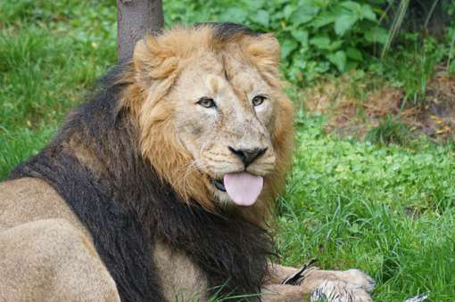

# Real-ESRGAN
PyTorch implementation of a Real-ESRGAN model trained on custom dataset. Forked from [Repo](https://github.com/ai-forever/Real-ESRGAN)

> Which partially uses code from the original researcher [original repository](https://github.com/xinntao/Real-ESRGAN)

Real-ESRGAN is an upgraded [ESRGAN](https://arxiv.org/abs/1809.00219) trained with pure synthetic data is capable of enhancing details while removing annoying artifacts for common real-world images. 

- [Paper (Real-ESRGAN: Training Real-World Blind Super-Resolution with Pure Synthetic Data)](https://arxiv.org/abs/2107.10833)
- [Original implementation](https://github.com/xinntao/Real-ESRGAN)

### Installation

```bash
pip install git+https://github.com/zurizaeyyay/Real-ESRGAN.git
```

### Usage

---

Basic usage:

```python
import torch
from PIL import Image
import numpy as np
from RealESRGAN import RealESRGAN

device = torch.device('cuda' if torch.cuda.is_available() else 'cpu')

model = RealESRGAN(device, scale=4)
model.load_weights('weights/RealESRGAN_x4.pth', download=True)

path_to_image = 'inputs/lr_image.png'
image = Image.open(path_to_image).convert('RGB')

sr_image = model.predict(image)

sr_image.save('results/sr_image.png')
```

Training usage:

Step 1: Put your training images in the directories
# Add high-resolution images (at least 1024x1024) to:
training_data/high_res/
training_data/validation/high_res/

Step 2: Run the training script
# Activate your conda environment
# Navigate to the Real-ESRGAN directory

# Start training
```
python train_realesrgan.py
```

Step 3: Resume training if error occurs
# In main() function of train_realesrgan.py, change this line to desired checkpoint:
checkpoint_path = 'checkpoints/checkpoint_epoch_.pth'

Training Recommendations
- GPU: At least 8GB VRAM (RTX 3070 or better)
- RAM: 32GB+ recommended
- Storage: Fast SSD for dataset

Dataset Recommendations
- Size: 10,000+ high-quality images minimum
- Resolution: At least 1024x1024 for HR images
- Variety: Diverse content (photos, art, different scenes)
- Quality: Clean, sharp images without artifacts

Training Parameters
- Batch Size: Start with 8-16, adjust based on GPU memory
- Learning Rate: 2e-4 to 1e-4
- Epochs: 300-500 epochs typically needed
- Patience: Training takes 1-7 days depending on hardware


### Examples

---

Low quality image:


Real-ESRGAN result:


---

Low quality image:


Real-ESRGAN result:


---

Low quality image:



Real-ESRGAN result:


